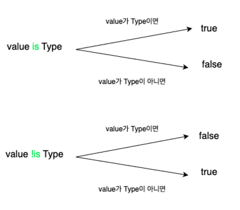
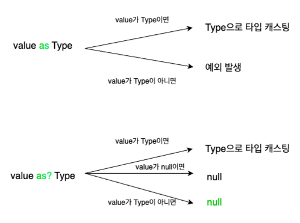
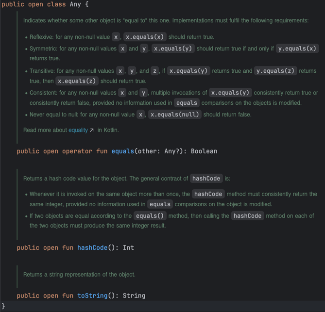

# Lec 03. 코틀린에서 Type을 다루는 방법

## 1. 기본 타입
- Java : 기본 타입간의 변환은 `암시적으로` 이루어질 수 있다
```java
int number1 = 4;
long number2 = number1;
System.out.println(number1+number2);
```
int 타입의 값이 long 타입으로 암시적으로 변경되었습니다.
Java에서 더 큰 타입으로는 암시적 변경이 되었죠!

- Kotlin : 기본 타입간의 변환은 `명시적으로` 이루어져야 한다
```kotlin
val number1 = 4
val number2: Long = number1 // Type mismatch
println(number1+number2)
```
Kotlin에서는 더 큰 타입이더라도 암시적 타입 변경이 불가능합니다!
그렇다면 어떻게 해야 할까요?!

- Kotlin에서는 `to` 키워드를 사용하여 타입을 변경할 수 있습니다
```kotlin
val number1 = 4
val number2: Long = number1.toLong()
println(number1+number2)
```
비슷한 예시로 어떤 `정수 나누기 정수`를 할때, 단순히 나눠버리면 결과의 타입이 무조건 정수니까
여기서 내가 실수의 결과를 얻고 싶다면 둘 중 하나를 Double이나 Float으로 변환해줘야 하잖아요.
Java에서는 앞에 (Double) 또는 (float)를 붙여서 변환했었는데, Kotlin에서는 `to` 키워드를 사용합니다.
```kotlin
val number1 = 3
val number2 = 5
val result = number1 / number2.toDouble()
println(result)
```

- 변수가 nullable 일 경우 적절한 처리가 필요하다!
```kotlin
    // nullable 변수 : Safe Call 과 Elvis 연산자 사용
    val number7: Int? = 3
    val number8: Long = number7?.toLong() ?: 0L
```

## 2. 타입 캐스팅 - is, as



`instanceof` : 변수가 주어진 타입이면 true, 그렇지 않으면 false
```java
public static void printAgeIfPerson(Object obj) {
	if (obj instanceof Person) {
        Person person = (Person) obj;
        System.out.println(person.getAge());
    }
}
```
```kotlin

fun printAgeIfPerson(obj: Any) {
    // is : java의 instanceof와 같은 역할
    if (obj is Person) {
        // as Person : java의 (Person)와 같은 역할 [생략 가능]
        // 스마트캐스트 : is로 타입을 검사한 후에는 자동으로 형변환이 된다.
        // 한 번 코틀린 컴파일러가 컨텍스트를 분석해가지고 타입을 추론하면 그 이후로는 타입을 명시하지 않아도 된다.
        // 즉, if안에 들어왔는데, if문 안에서 타입을 검사했으니까 obj는 Person이다. 그래서 obj.age를 사용할 수 있다.
        val person = obj as Person
        println(obj.age)
    }
}
```
instanceof의 반대도 존재할까? `!is`
```java
public static void printAgeIfNotPerson(Object obj) {
    if (!(obj instanceof Person)) {
        System.out.println("Not a Person");
    }
}
```
```kotlin
fun printAgeIfPerson(obj: Any) {
    if (obj !is Person) {
        println("Not a Person")
    }
}
```

만약 obj에 null이 들어올 수 있다면?!



```kotlin
fun printAgeIfPerson(obj: Any) {
    // is : java의 instanceof와 같은 역할
    if (obj is Person) {
        // as Person : java의 (Person)와 같은 역할 [생략 가능]
        // 스마트캐스트 : is로 타입을 검사한 후에는 자동으로 형변환이 된다.
        // 한 번 코틀린 컴파일러가 컨텍스트를 분석해가지고 타입을 추론하면 그 이후로는 타입을 명시하지 않아도 된다.
        // 즉, if안에 들어왔는데, if문 안에서 타입을 검사했으니까 obj는 Person이다. 그래서 obj.age를 사용할 수 있다.
        val person = obj as Person
        println(obj.age)
    }
}

fun printAgeIfPerson2(obj: Any?) {
    // as? 의 의미 : obj가 Person이면 Person으로 형변환하고, 아니면 null을 반환한다.
    // 그러면 person의 내용을 호출할때 ?.을 사용해서 null이면 null로 반환한다.
    val person = obj as? Person
    println(person?.age)
}
```

## 3. Kotiln의 특이한 타입 3가지

### Any

- Java의 `Object`t와 비슷한 역할을 한다(모든 객체의 최상위 타입)
- 모든 Primitive Type의 최상위 타입도 Any이다.(자바와 다른점)
  - kotlin에서는 Primitive Type과 Reference Type을 구분없이 Int, Long을 사용하기 때문이다
- Any자체로는 null을 포함할 수 없어 null을 포함하고 싶다면, Any?로 표현
- Any에 equals / hashCode / toString 존재.


### Unit

- Java의 `void`와 비슷한 역할을 한다
  - 물론 타입 추론이 가능하기 때문에 생략 가능하다
- void와 다르게 Unit은 그 자체로 타입 인자로 사용 가능하다
- 함수형 프로그래밍에서 Unit은 단 하나의 인스턴스만 갖는 타입을 의미.
  - 즉, 코틀린의 Unit은 `실제 존재하는 타입`이라는 것을 표현

### Nothing

- Nothing은 함수가 정상적으로 끝나지 않았다는 사실을 표현하느 ㄴ역할
- 무조건 예외를 반환하는 함수 / 무한 루프 함수 등
  - 실제 코딩하면서 많이 사용하지는 않는다.
```kotlin
fun fail(message: String): Nothing {
    throw IllegalArgumentException(message)
}
```

## 4. String interpolation / String indexing

- String interpolation : 문자열 내부에 변수를 넣어서 출력하는 방법

```java
Person person = new Person("Kotiln", 40);
String log = String.format("사람의 이름은 %s이고 나이는 %s세 입니다", person.getName(), person.getAge());
```
```java
StringBuilder builder = new StringBuilder();
builder.append("사람의 이름은 ");
builder.append(person.getName());
builder.append("이고 나이는 ");
builder.append(person.getAge());
builder.append("세 입니다");
```
```kotlin
val person = Person("Kotlin", 40)
val log = "사람의 이름은 ${person.name}이고 나이는 ${person.age}세 입니다"

// 중괄호 없이도 사용 가능하다
val name = "Kotlin"
println("이름 : $name")
```

TIP : 변수 이름만 사용하더라도 `${변수}`를 사용하는 것이
1) 가독성이 좋다
2) 일괄 변경이 용이하다
3) 정규식 활용 가능하다

여러 줄에 걸친 문자열을 작성해야 할때
```kotlin
val withoutIndex =
"""
    ABC
    123
    456
    
""".trimIndent()
println(withoutIndex)
```


어떤 문자열에서 특정 문자 가져오기
```java
String str = "Hello, Kotlin!";
char c = str.charAt(7);
```
```kotlin
val str = "Hello, Kotlin!"
val c = str[7]
```

## 정리
- 코틀린의 변수는 초기값을 보고 타입을 추론하며, 기본 타입들간의 변환은 명시적으로 이루어진다
- 코틀린에서는 `is, !is, as, as?` 를 활용해서 타입을 확인하고 캐스팅한다
- 코틀린의 Any는 Java의 Object와 같은 최상위 타입이다
- 코틀린의 Unit은 Java의 void와 동일하다
- 코틀린에 있는 Nothing은 정상적으로 끝나지 않는 함수의 반환을 의미한다.
- 문자열을 가공할때 `${변수}`와 `""""""`를 사용하면 깔끔한 코딩이 가능하다
- 문자열에서 문자를 가져올때 Java의 배열처럼`[]`를 사용하면 된다
