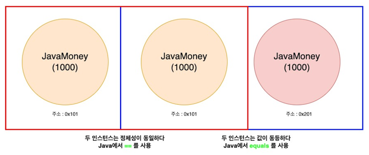

# Lec 04. 코틀린에서 연산자를 다루는 방법

## 📌 1. 단항 연산자 / 산술 연산자

> Java와 Kotlin 완전 동일합니다
- 단항 연산자 : ++ , --
- 산술 연산자 : +, -, *, /, %
- 산술대입 연산자 : +=, -=, *=, /=, %=

> Java, Kotlin 사용법은 동일하지만, 단!
- 비교 연산자 : >, <, >=, <=

Java와 다르게 객체를 비교할때 비교 연산자를 사용하면 자동으로 `compareTo`를 호출해줍니다.

```java
public class JavaMoney implements Comparable<JavaMoney> {
	
	private final long amount;
	
	public JavaMoney(long amount) {
        this.amount = amount;
    }
	
	@Override
    public int compareTo(JavaMoney o) {
        return Long.compare(amount, o.amount);
    }
	
}
```

```java
if (money1.compareTo(money2) > 0) {
    System.out.println("Money1이 Money2보다 금액이 큽니다");
}
```
```kotlin
if (money1 > money2) {
    print("Money1이 Money2보다 금액이 큽니다")
}
```

## 📌 2. 비교 연산자와 동등성, 동일성

- 동등성(Equality) : 두 객체의 `값`이 같은가?!
- 동일성(Identity) : 완전히 동일한 객체인가?! 즉 `주소(레퍼런스)`가 같은가?!


> Java에서는 동일성에 `==`를 사용, 동등성에 `equals`를 직접 호출

> Kotlin에서는 동일성에 `===`를 사용, 동등성에 `==`를 호출.  
==를 사용하면 간접적으로 equals를 호출해준다.

```java
System.out.println(money11 == money12); // true
System.out.println(money11 == money13); // false

// JavaMoney클래스에 equals(), hashCode() 메서드를 오버라이딩 할 경우
System.out.println(money11.equals(money13)); // true
```
```kotlin
println(money11 === money12) // true
println(money11 === money13) // false
println(money11 == money13) // true
```

## 📌 3. 논리 연산자 / 코틀린에 있는 특이한 연산자

- 논리연산자 : &&, ||, !
  - Java와 완전히 동일한데, Java처럼 `Lazy연산` 을 수행합니다.

```kotlin
fun main() {

    // 2개 중 앞에 하나만 true여도 뒤에 것은 실행되지 않음
    if (fun1() || fun2()) {
        println("본문")
    }
  // 출력문 : fun 1
  //         본문
  
  
    // 2개 중 앞에 하나만 false여도 뒤에 것은 실행되지 않음
    if (fun2() && fun1()) {
        println("본문")
    }
  // 출력문 : fun 2
}

fun fun1(): Boolean {
    println("fun 1")
    return true
}

fun fun2(): Boolean {
    println("fun 2")
    return false
}
```

- in / !in
  - 컬렉션이나 범위에 포함되어 있다, 포함되어 있지 않다

```kotlin
println(1 in numbers)
```

- a..b
  - a부터 b까지의 범위 객체를 나타냄
  - a부터 b까지, a부터 b-1까지

- a[i]
  - a에서 특정 Index i로 값을 가져온다
- a[i] = b
  - a의 특정 Index i에 b를 넣는다

## 📌 4. 연산자 오버로딩

Kotlin에서는 객체마다 연산자를 직접 정의할 수 있다
- 객체마다 메소드를 별도로 만들지 않아도, 단항 연산, 비교 연산, 여러 연산이 직접 정의 가능하다
```kotlin
val money21 = Money(1_000L)
val money22 = Money(2_000L)
// 둘다 가능
println(money21.plus(money22)) // Money(amount=3000
println(money21 + money22) // Money(amount=3000)
```

## 📌 정리

- 단항 연산자, 산술 연산자, 산술대입 연산자는 Java와 똑같다
- 비교 연산자 사용법도 Java와 똑같다
  - 단, 객체끼리 자동 호출되는 `compareTo`를 이용해 비교 연산자를 사용할 수 있다.
- `in`, `!in` / `a..b` / `a[i]` / `a[i] = b` 와 같이 코틀린에서 새로 생긴 연산자도 있다
- 객체끼리의 연산자를 직접 정의할 수 있다