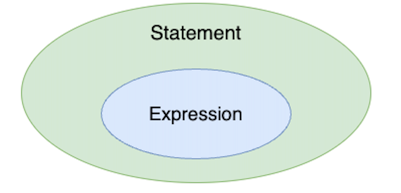

# Lec 05. 코틀린에서 제어문을 다루는 방법

## 📌 1. if 문

```java
private void validateScoreIsNotNegative(int score) {
	if (score < 0) {
		throw new IllegalArgumentException(String.format("%s는 0보다 작을 수 없습니다.", score));
	}
}
```
```
fun validateScoreIsNotNegative(score: Int) {
    if (score < 0) {
        throw IllegalArgumentException("${score}는 0보다 작을 수 없습니다")
    }
}
```
> 차이점
> 1. void가 없음. Unit을 사용할 수 있지만, 생략함
> 2. 코틀린에서 함수 만들때 fun 키워드를 사용함
> 3. new를 사용하지 않고 예외를 throw


```java
private String getPassOrFail(int score) {
    if (score >= 50) {
        return "P";
    } else {
        return "F";
    }
}
```
```kotlin
fun getPassOrFail(score: Int): String {
    if (score >= 50) {
        return "P"
    } else {
        return "F"
    }
}
```
> Java와 똑같이 생겼지만, 한 가지 다른 점이 있다
> Java에서 if-else는 `Statement`이지만, Kotlin에서는 `Expression`이다.
- Statememt : 프로그램의 문장, 하나의 값으로 도출되지 않는다
- Expression : 하나의 값으로 도출된다
 - 즉, Statement 중에 하나의 값으로 도출되는 문장들이 Expression이다.




## 📌 2. Expression과 Statement


### ✨Java에서 if-else는 Statement이지만, Kotlin에서는 Expression이다.

> [예시]
> ```java
> int score = 30 + 40;
> ```
> [30 + 40] 은 70이라는 하나의 결과가 나옵니다
> 즉, Expression이면서 Statement이다.
>
> ```java
> String grade = if (score >= 50) {
>   "P";
> } else {
>   "F";
> }
>```
> if문을 하나의 값으로 취급하지 않아서 에러가 난다 = Statement이기 때문
> 그래서 = 을 통해서 P나 F를 대입할 수 없어서 Statement라고 한다.
> Java에서는 이러한 상황을 해결하기 위해 `3항 연산자`를 사용한다
> ```java
> String grade = score >= 50 ? "P" : "F";
>```
> 3항 연산자는 하나의 값으로 취급하므로 에러가 없다! = Expression이면서 Statement이기 때문이다.
>
> 하지만 Kotlin에서는 if-else를 Expression으로 사용할 수 있다.
>```kotlin
>fun getPassOrFail(score: Int): String {
>    return if (score >= 50) {
>        "P"
>    } else {
>        "F"
>    }
>}
>```
>따라서 Kotlin에서는 if-else를 expression으로 사용할 수 있기 때문에 3항 연산자가 없다.


### 간단한 TIP
어떠한 값이 특정 범위에 포함되어 있는지, 포함되어 있지 않은지
```java
if (0 <= score && score <= 100) {}
```
in을 사용하면 between을 깔끔하게 사용할 수 있다
```kotlin
if (score in 0..100) {}
```

## 📌 3. switch와 when

```java
private String getGradeWithSwitch(int score) {
    switch (score / 10) {
        case 9:
            return "A";
        case 8:
            return "B";
        case 7:
            return "C";
        case 6:
            return "D";
        default:
            return "F";
    }
}
```
```kotlin
fun getGradeWithSwitch(score: Int): String {
    return when (score/10) {
        9 -> "A"
        8 -> "B"
        7 -> "C"
        6 -> "D"
        else ->  "F"
    }
}
```
```kotlin
fun getGradeWithSwitch(score: Int): String {
    return when (score) {
        in 90..100 -> "A"
        in 80..89 -> "B"
        in 70..79 -> "C"
        in 60..69 -> "D"
        else ->  "F"
    }
}
```
> 차이점
> 1. switch 대신 when이 들어갔다.
> 2. case 대신 경우를 작성하고 ->로 분기를 사용한다
> 3. default 대신 else를 사용한다

이 when은 다양한 형태로 사용할 수 있다
```text
when (값) {
    조건부 -> 어떠한 구문
    조건부 -> 어떠한 구문
    else -> 어떠한 구문
}
```

### ✨조건문 : 어떠한 expression이라도 들어갈 수 있다 (ex. is Type)
```java
private booealn startsWithA(Object obj) {
    if (obj instanceof String) {
        return ((String) obj).startsWith("A");
    }
    return false;
}
```
```kotlin
fun startsWithA(obj: Any): Boolean {
    return when (obj) {
        is String -> obj.startsWith("A")
        else -> false
    }
}
```
### ✨조건문 : 여러 개의 조건을 동시에 검사할 수 있다 (,로 구분)

```java
private void judgeNumber(int number) {
	if (number == 1 || number == 0 || number == -1) {
        System.out.println("어디서 많이 본 숫자입니다.");
    } else {
        System.out.println("1, 0, -1이 아닙니다.");
	}
}
```
```kotlin
fun judgeNumber(number: Int) {
    when (number) {
        1, 0, -1 -> println("어디서 많이 본 숫자입니다.")
        else -> println("1, 0, -1이 아닙니다.")
    }
}
```
### ✨값 : 값 자체가 없을 수도 있다 - early return처럼 동작한다

```java
private void judgeNumber2(int number) {
	if(number ==0) {
        System.out.println("주어진 숫자는 0입니다.");
        return;
    }
    if(number % 2 == 0) {
        System.out.println("주어진 숫자는 짝수입니다.");
        return;
    }
    System.out.println("주어진 숫자는 홀수입니다.");
}
```
```kotlin
fun judgeNumber2(number: Int) {
    when {
        number == 0 -> println("주어진 숫자는 0입니다.")
        number % 2 == 0 -> println("주어진 숫자는 짝수입니다.")
        else -> println("주어진 숫자는 홀수입니다.")
    }
}
```

어떠한 값이 있다면 그 값이 다음 조건에 해당하는지를 살펴보고  
값이 없다면 그냥 조건 자체를 살펴봐서 수행한다.  
즉, Java의 swtich-case문보다 Kotlin의 when문이 훨씬 더 유연하다.

> [참고]
> - [Kotlin Reference - Control Flow](https://kotlinlang.org/docs/control-flow.html)
> - [Kotlin Reference - When Expression](https://kotlinlang.org/docs/when.html)
> when은 Enum Class 혹은 Sealed Class와 함께 사용할 경우, 더욱 더 진가를 발휘한다.

## 📌 정리
- if / if - else / if - else if - else 모두 Java와 문법이 동일하다
- 단 Kotlin에서는 Expression으로 취급된다.
  - 때문에 Kotlin에서는 삼항 연산자가 없다. 
- Java의 switch는 Kotlin의 when으로 대체되었고, when은 더 강력한 기능을 갖는다. 