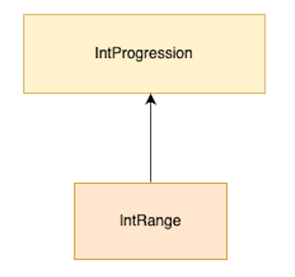
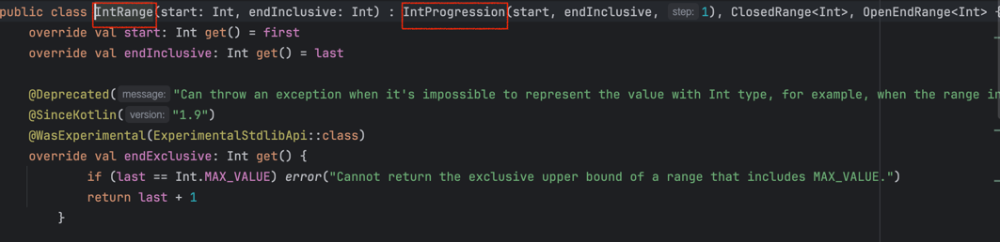
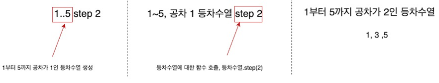

# Lec 06. 코틀린에서 반복문을 다루는 방법

## 📌 1. for-each 문

### ✨숫자가 들어 있는 리스트를 하나씩 출력하는 예제

```java
List<Long> numbers = Arrays.asList(1L, 2L, 3L);
for (Long number : numbers) {
    System.out.println(number);
}
```
```kotlin
val numbers = listOf(1L, 2L, 3L)
for (number in numbers) {
    println(number)
}
```
> 차이점
> 1. 컬렉션 만드는 방법이 다르다
> 2. 콜론(:) 대신 in을 사용한다
> 3. in뒤에는 Java와 동일하게 Iterable이 구현된 타입이라면 모두 들어갈 수 있다. 

## 📌 2. 전통적인 for 문

### ✨1부터 3까지 출력하는 예제
```java
for (int i = 1; i <= 3; i++) {
    System.out.println(i);
}
```
```kotlin
for (i in 1..3) {
    println(i)
}
```

### ✨내려가는 경우
```java
for (int i = 3; i >= 1; i--) {
    System.out.println(i);
}
```
```kotlin
for (i in 3 downTo 1) {
    println(i)
}
```
### ✨2칸씩 올라가는 경우 
```java
for (int i = 1; i <= 5; i += 2) {
    System.out.println(i);
}
```
```kotlin
for (i in 1..5 step 2) {
    println(i)
}
```
## 📌 3. Progrssion과 Range : 동작원리
- ..연산자 : 범위를 만들어 내는 연산자
  - 1..3 : 1부터 3의 범위

여기서 범위라는 건 실제 Range라는 클래스를 사용한다
Range라는 클래스는 Progression 한국어로 하면 `등차수열`인 클래스를 상속받는다.




```kotlin
for (i in 1..3) {
    println(i)
}
```
해당 코드에서 1..3의 의미는 "1에서 시작하고 3으로 끝나는 등차수열을 만들어줘"라는 것을 의미한다.  
> 등차수열에서 필요한 것
> 1. 시작 값
> 2. 끝 값
> 3. 공차(몇 칸씩 뛸지)

사실은 이 코드가 등차수열을 만들어주는 코드인 것이다!

- 3 downTo 1 : 시작값 3, 끝값 1, 공차가 -1인 등차수열
- 1..5 step 2 : 시작값 1, 끝값 5, 공차가 2인 등차수열

- downTo와 step 도 함수이다! `중위 호출 함수`
  - 변수.함수이름(argument) 대신 `변수 함수이름 argument`로 호출 가능하다.



> 한줄 요약 : Kotlin에서 전통적인 for문은 등차수열을 이용한다!

## 📌 4. while 문

Java와 Kotlin의 while문은 동일하다. do-while문도 동일하다.

### ✨1부터 3을 출력하는 예제
```java
int i = 1;
        while (i <= 3) {
        System.out.println(i);
i++;
        }
```
```kotlin
var i = 1
while (i <= 3) {
  println(i)
  i++
}
```

## 📌 정리

- for each문에서 Java는 `:`, Kotlin은 `in`을 사용한다.
- 전통적인 for문에서 kotlin은 `등차수열`과  `in`을 사용한다.
- 그 외 for 문 문법은 모두 동일하다.
- while문과 do while문은 더욱더 놀랍도록 동일하다.