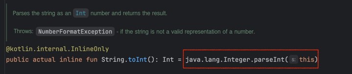
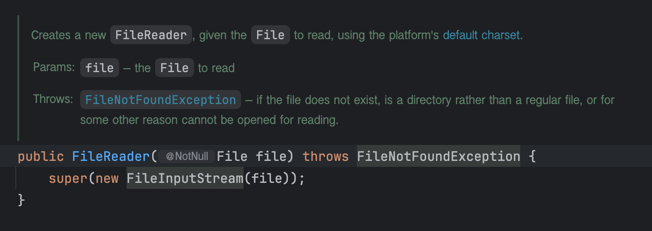
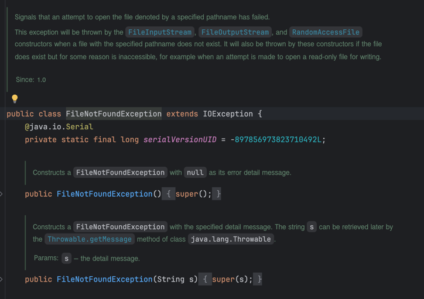
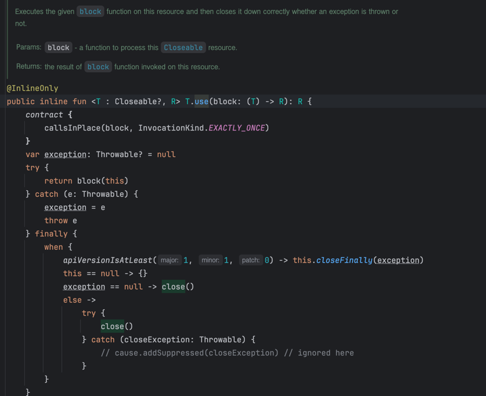

# Lec 05. 코틀린에서 예외를 다루는 방법

## 📌 1. try catch finally 구문

### ✨주어진 문자열을 정수로 변경하는 예제
```java
private int pareseIntOrThrow(@NotNull String str) {
    try {
        return Integer.parseInt(str);
    } catch (NumberFormatException e) {
        throw new IllegalArgumentException(String.format("주어진 %s는 숫자가 아닙니다.", str));
    } 
}
```
```kotlin
fun parseIntOrThrow(str: String): Int {
    try {
        // 기본 타입간의 형변환은 toType()을 사용
        return str.toInt()
    } catch (e: NumberFormatException) {
        throw IllegalArgumentException("주어진 ${str}는 숫자가 아닙니다.")
    }
}
```

> 차이점
> 1. 코틀린에서는 기본 타입간의 형변환은 `toType()`을 사용 (내부적으로 parseType()을 호출한다.)
> 2. catch 구분에서 타입이 뒤에 위치하고, 예외 객체를 앞에서 받는다.
> 3. throw 구문에서는 new 키워드 없이 throw 키워드만 사용한다.
> 4. 자바보다 코틀린에서 포맷팅이 간결하다.

### ✨주어진 문자열을 정수로 변경하는 예제, 실패하면 NULL을 반환!
```java
private Integer parseIntOrThrowV2(String str) {
	    try {
        return Integer.parseInt(str);
    } catch (NumberFormatException e) {
        return null;
    }
}
```
- try catch 구문도 if-else처럼 하나의 Expression으로 간주된다.
```kotlin
fun parseIntOrThrowV2(str: String): Int? {
return try {
    str.toInt()
} catch (e: NumberFormatException) {
    null
}
```

## 📌 2. Checked Exception과 Unchecked Exception

### ✨프로젝트 내 파일의 내용물을 읽어오는 예제

```java
public void readFile() throws IOException {
    File currentFile = new File(".");
	File file = new File(currentFile.getAbsoluteFile(), "/a.txt");
	BufferedReader reader = new BufferedReader(new FileReader(file));
	System.out.println(reader.readLine());
	reader.close();
}
```
```kotlin
fun readFile() {
    val currentFile = File(".")
    val file = File(currentFile.absolutePath + "/a.txt")
    val reader = BufferedReader(FileReader(file))
    println(reader.readLine())
    reader.close()
}
```
> 차이점
> 1. 코틀린에서는 throws 구문이 없다!
>    1. Kotiln에서는 Checked Exception과 Unchecked Exception을 구분하지 않는다.
>    2. 모두 Unchecked Exception으로 처리한다.




- I/O Exception이 발생함에도 불구하고 throws를 명시하지 않아도 된다.

## 📌 3. try with resources

### ✨프로젝트 내 파일의 내용물을 읽어오는 예제
```java
public void readFile(String path) throws IOException {
	// 괄호 안에 외부 자원을 만들어주고, try가 끝나면 자동으로 외부 자원을 닫아주는 try with resources 구문
    try (BufferedReader reader = new BufferedReader(new FileReader(path))) {
        System.out.println(reader.readLine());
    }
}
```
```kotlin
fun readFile(path: String) {
    BufferedReader(FileReader(File(path))).use { reader ->
        println(reader.readLine())
    }
}
```

> 차이점
> 1. 코틀린에서는 try with resources 구문이 없다!
> 2. 대신 `use` 라는 inline 확장 함수를 사용한다.


## 📌 정리
- try catch finally 구문은 문법적으로 자바랑 코틀린이 완전히 동일하다
  - Kotiln에서는 try catch가 expression이다.
- Kotlin에서 모든 예외는 Unchecked Exception으로 처리한다.
- Kotlin에서는 try with resources 구문이 없다. 대신 코틀린의 언어적 특징을 활용해 CLOSE를 호출해준다