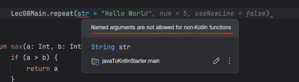

# Lec08. 코틀린에서 함수를 다루는 방법

## 📌 1. 함수 선언 문법

### ✨두 정수를 받아 더 큰 정수를 반환하는 예제
```java
public int max(int a, int b) {
    if (a > b) {
        return a;
    }
    return b;
}
```
```kotlin
fun max(a: Int, b: Int): Int {
    if (a > b) {
        return a
    }
    return b
}

fun maxV2(a: Int, b: Int): Int {
    // if-else가 하나의 Expression
    return if (a > b) {
        a
    } else {
        b
    }
}

// Expression이기 때문에 중괄호를 없애고 =로 대체 가능
fun maxV3(a: Int, b: Int): Int =
    if (a > b) a else b

// 반환 타입을 생략할 수 있음 (타입 추론)
fun maxV4(a: Int, b: Int) = if (a > b) a else b
```

- 코틀린에서 함수에 접근 지시어가 없으면 기본적으로 public이다.(생략 가능)
- fun은 함수를 의미하는 키워드
- 함수가 하나의 결과값이면 block 대신 `=` 사용 가능
- 한 줄로 변경 가능
- `=` 을 사용하는 경우 `반환 타입 생략 가능`
  - 블록{}을 사용하는 경우에는 반환 타입이 Unit이 아니라면, 명시적으로 작성해주어야 한다
- 함수는 클래스 안에 있을 수도, 파일 최상단에 있을 수도 있다.
  - 또한, 한 파일 안에 여러 함수들이 있을 수도 있다.

## 📌 2. default parameter

### ✨주어진 문자열을 N번 출력하는 예제
```java
public void repeat(String str, int num, boolean useNewLine) {
  for (int i = 1; i <= num; i++) {
    if (useNewLine) {
      System.out.println(str);
    } else {
      System.out.print(str);
    }
  }
}
// 이미 많은 코드에서 useNewLine을 true로 사용하고 있는 경우, 이 함수를 사용하는 입장에서는 귀찮음
public void repeat(String str, int num) {
  repeat(str, num, true);
}

// 이미 많은 코드에서 출력을 3번씩 하고 있다면, 이 함수를 사용하는 입장에서는 귀찮음
public void repeat(String str) {
  repeat(str, 3, true);
}
```
- 단점 : 메소드를 3개나 만들어야 한다 -> 중복
- default parameter를 사용하면 이런 문제를 해결할 수 있다.
```kotlin
fun repeat(
  str: String, 
  num: Int = 3, 
  useNewLine: Boolean = true
) {
    for (i in 1..num) {
        if (useNewLine) {
            println(str)
        } else {
            print(str)
        }
    }
}
```
- 밖에서 파라미터를 넣어주지 않으면 기본값을 사용할 수 있다.
## 📌 3. named argument(parameter)

만약 위의 코드에서 repeat을 호출할때 num은 3을 그대로 쓰고, useNewLine은 false로 바꾸고 싶다면?
```kotlin
repeat("Hello World", useNewLine = false)
```
- 매개변수 이름을 통해 직접 지정, 지정되지 않은 매개변수는 기본값 사용
- builder를 직접 만들지 않고 builder의 장점을 가지게 된다

> named argument의 장점
> 1. 함수를 호출하는 쪽에서 파라미터가 같은 타입이 많은 경우, 편하게 막 넣다가 
> 2. 컴파일 단에서 에러를 잡아준다.
> 3. builder를 직접 만들지 않고 builder의 장점을 갖게 된다.
> ```kotlin
> printNameAndGender(name = "박세진", gender = "female")
> ```
> 주의사항 : Kotiln에서 Java함수를 가져다 사용할 때는 named argument를 사용할 수 없다.
> 
> 이유 : JVM상에서 Java가 바이트 코드로 변환됐을 때, parameter이름을 보존하고 있지 않다보니까, 코틀린에서는 그 이름을 통해서 가져오는 named argument를 쓸 수 없습니다. 

## 📌 4. 같은 타입의 여러 파마리터 받기 (가변인자)

### ✨문자열을 N개 받아 출력하는 예제

- Java에서 타입...을 쓰면 가변인자 사용!
```java
public void printAll(String... strings) {
    for (String s : strings) {
        System.out.println(s);
    }
}
```
- 위의 코드를 호출하는 쪽에서는 배열을 직접 넣거나, comma를 이용해 여러 파라미터를 넣거나
```java
String[] array = new String[]{"A","B","C"};
printAll(array);

printAll("A","B","C");
```
- kotlin에서는 vararg를 쓰면 가변인자 사용!
```kotlin
fun printAll(vararg strings: String) {
    for (str in strings) {
        println(str)
    }
}
```
- 위의 코드를 호출하는 쪽에서는 배열을 직접 넣거나, comma를 이용해 여러 파라미터를 넣거나
- Java와 달리 배열을 가변인자에 넣을 때는 앞에 `*`을 사용해야 한다.
- Spread 연산자(`*`)의 역할 = 배열안에 있는 것들을 마치 그냥 ,로 나열한 것처럼 사용할 수 있게 해준다.
```kotlin
printAll("A", "B", "C", "D")

val array = arrayOf("Hello", "World", "Kotlin")
printAll(*array)
```

# 📌 정리
- 함수의 문법은 Java와 다르다!
```text
접근지시어 fun 함수이름(파라미터): 반환타입 {
    // 함수 내용
}
```
- 함수에서 body가 하나의 값으로 간주되는 경우 block을 없앨 수도 있고, block이 없다면 반환 타입을 없앨 수도 있다.
```kotlin
fun max(a: Int, b: Int): Int = if (a > b) a else b
fun max(a: Int, b: Int) = if (a > b) a else b
```
- 함수 파라미터에 기본 값을 설정해줄 수 있다.
- 함수를 호출할때 특정 파라미터를 지정해 넣어줄 수 있다.
- 가변인자에는 vararg 키워드를 사용하며, 가변인자 함수를 배열과 호출할 때는 *를 붙여주어야 한다.