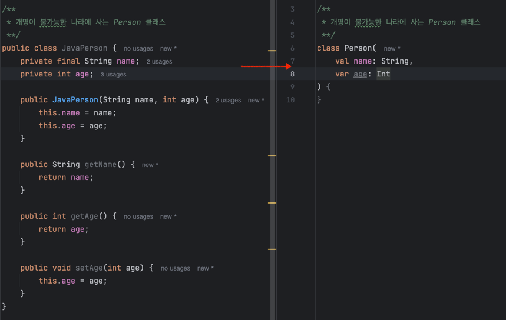
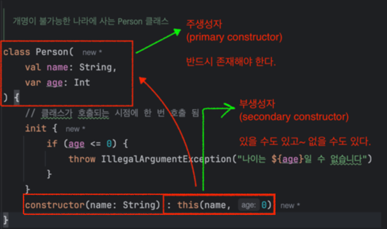
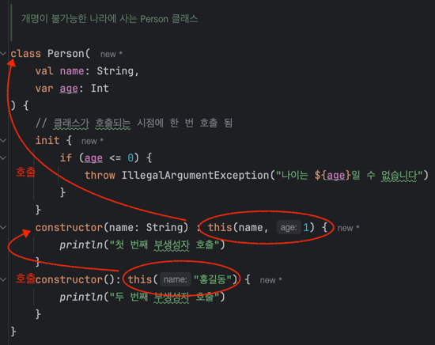
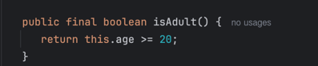
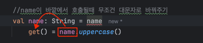

# Lec09. 코틀린에서 클래스를 다루는 방법

## 📌 1. 클래스와 프로퍼티

```java
/**
 * 개명이 불가능한 나라에 사는 Person 클래스
 **/
public class JavaPerson {
	private final String name;
	private int age;
	
	public JavaPerson(String name, int age) {
		this.name = name;
		this.age = age;
	}
}
```
- 프로퍼티 = 필드 + getter + setter
- 코틀린에서는 필드만 만들면 `getter, setter를 자동으로 만들어준다
```kotlin
class Person constructor(name: String, age: Int) {

    val name: String = name
    var age: Int = age
}

// 타입은 생략 가능하다, 타입 추론  
class Person constructor(name: String, age: Int) {
    val name = name
    var age = age
}

// constructor 키워드 생략 가능
class Person (name: String, age: Int) {
    val name = name
    var age = age
}

// 코틀린에서는 생성자를 만들어 줄 때 동시에 필드, 정확히는 프로퍼티를 선언할 수 있다
// 즉, 클래스의 필드 선언과 생성자를 동시에 선언할 수 있다.
class Person(
    val name: String,
    var age: Int
)
```


- Kotlin에서는 `.필드` 를 통해 getter, setter를 바로 호출한다.
```kotlin
val person = Person("박세진", 27)
println(person.name) // getter
person.age = 10 // setter
println(person.age) // getter
```
- Java 클래스에 대해서도 `.필드`로 getter, setter를 바로 호출한다.
```kotlin
    val person2 = JavaPerson("박세진", 27)
    println(person2.name) // getter
    person2.age = 10 // setter
    println(person2.age) // getter
```
## 📌 2. 생성자와 init

### ✨클래스가 생성되는 시점에 나이를 검증해보자!
```java
public JavaPerson(String name, int age) {
    if (age <= 0) {
        throw new IllegalArgumentException(String.format("나이는 %s일 수 없습니다",age));
    }
    this.name = name;
    this.age = age;
}
```
- 그렇다면 코틀린 생성자에서는 어디서 검증해야할까? 괄호가 생성자라고는 하는데..
```kotlin
class Person(
    val name: String,
    var age: Int
)
```
- 아래처럼 `init블록`을 사용하면 된다.
```kotlin
class Person(
    val name: String,
    var age: Int
) {
    // 클래스가 호출되는 시점에 한 번 호출 됨
    init {
        if (age <= 0) {
            throw IllegalArgumentException("나이는 ${age}일 수 없습니다")
        }
    }
}
```
### ✨최초로 태어나는 아기는 무조건 1살이니, 생성자를 하나 더 만들자!
```java
public JavaPerson(String name) {
    // 기존에 있던 생성자를 호출
    this(name, 1);
}
```
- 코틀린에서는 `constructor` 키워드를 사용하여 생성자 오버로딩을 만들 수 있다.
```kotlin
class Person(
    val name: String,
    var age: Int
) {
    // 클래스가 호출되는 시점에 한 번 호출 됨
    init {
        if (age <= 0) {
            throw IllegalArgumentException("나이는 ${age}일 수 없습니다")
        }
    }
    constructor(name: String) : this(name, 0)
}
```
- 그러면 Person클래스에 이름만 넣고도 인스턴스화할 수 있다.
```kotlin
val person3 = Person("박세진")
```


- `주 생성자`는 주생성자에 파라미터가 하나도 없다면 `생략 가능`하다!
```kotlin
fun main() {
    Student()
}
class Student()
```
- `부 생성자`는 최종적으로 주생성자를 this로 호출해야 한다.
- body를 가질 수 있다.  

- 본문은 역순으로 실행된다!
```kotlin
class Person(
    val name: String,
    var age: Int
) {
    // 클래스가 호출되는 시점에 한 번 호출 됨
    init {
        if (age <= 0) {
            throw IllegalArgumentException("나이는 ${age}일 수 없습니다")
        }
        println("초기화 블록")
    }
    constructor(name: String) : this(name, 1) {
        println("첫 번째 부생성자 호출")
    }
    constructor(): this("홍길동") {
        println("두 번째 부생성자 호출")
    }
}
```
- 실행 결과
- 2번째 부생성자를 호출했는데, 타고타고 올라간다음 초기화 블록부터 실행된다.
```text
초기화 블록
첫 번째 부생성자 호출
두 번째 부생성자 호출
```
- 하지만 사실... 코틀린에서는 부생성자보다는 `default parameter`를 권장합니다!
```kotlin
class Person(
    // default parameter
    val name: String = "홍길동", 
    var age: Int = 1,
) {
    // 클래스가 호출되는 시점에 한 번 호출 됨
    init {
        if (age <= 0) {
            throw IllegalArgumentException("나이는 ${age}일 수 없습니다")
        }
    }
}
```
- 그런데 어쩔 수 없이 부생성자를 써야 하는 경우가 있다.
- `Converting(A객체를 B객체로 변경)`과 같은 경우 부생성자를 사용할 수 있지만, 그보다는 정적 팩토리 메소드를 추천드립니다!
## 📌 3. 커스텀 getter, setter
### ✨성인인지 확인하는 기능 추가하기
```java
public boolean isAdult() {
    return age >= 20;
}
```
- 코틀린에서는 `getter`를 커스텀할 수 있다.
```kotlin
class Person(
    val name: String,
    var age: Int
) {
    // 클래스가 호출되는 시점에 한 번 호출 됨
    init {
        if (age <= 0) {
            throw IllegalArgumentException("나이는 ${age}일 수 없습니다")
        }
    }
    val isAdult: Boolean
        get() = age >= 20
}
```
```kotlin
fun isAdult(): Boolean {
    return this.age >= 20
}

//custom getter
val isAdult: Boolean
    get() = this.age >= 20

//custom getter
val isAdult: Boolean
    get() {
        // 하나의 Expression으로 표현되는 것을 =으로 할 수 도 있고,
        // 아니면 return 으로 표현할 수도 있다.
        return this.age >= 20
    }
```
- custom getter를 show kotlin bytecode로 Decompile해서 자바코드를 확인해보자.
- 동일하게 메소드가 있는것 처럼 표현되는것을 볼 수 있다.

### ✨위의 3가지 방법은 모두 동일한 기능이고, 표현 방법만 다르다! (가독성)
그렇다면 어떤 방식이 제일 나을까?
- 객체의 `속성`이라면 custom getter를 사용하자.
  - 클래스 접근 시 프로퍼티에 접근하는 용도
- `그렇지 않다면` 함수를 사용하자.

### ✨Custom getter를 사용하면 자기 자신을 변형해 줄 수도 있다!
- name을 get할때 무조건 대문자로 바꾸어보자
```kotlin
class Person(
    // default parameter
    name: String = "홍길동", // val name을 생성자안에 선언하면 프로퍼티라서 getter를 자동으로 만들어준다 -> 자동으로 만들지 않으려면 val 빼기
    var age: Int = 1,
) {

    //name이 바깥에서 호출될때 무조건 대문자로 바꿔주기
    val name: String = name
        get() = field.uppercase()
          ...
}
```
- 주생성자에서 받은 name을 불변 프로퍼티 name에 바로 대입
- 이때 name을 대문자로 바꿔서 반환하기 위해 Custom getter를 만들때 `field`를 사용
  - 4. backing field에서 설명

### ✨name을 set할때 무조건 대문자로 바꾸어주자!
```kotlin
var name: String = name
    set(value) {
        field = value.uppercase()
    }
```
- 사실은 setter 자체를 `지양`하기 때문에 custom setter도 잘 안쓴다
- 무분별하게 setter를 사용하는것보다는 update 같은 함수를 만들어서 사용하는것이 좋다.
- 그러다보니 backing setter를 활용하는 custom setter도 잘 안쓰게 된다.
## 📌 4. backing field

### ✨왜 field를 사용하는것일까?! 이게 무엇일까? - 자기 자신을 가르키는 보이지 않는 필드
```kotlin
val name: String = name
    get() = name.uppercase()
```

- 밖에서 name을 불렀을때 get()이 불리는데, get()을 부르면 name이라는 field가 먼저 호출된다.
  - 밖에서 person.name하면 name에 대한 getter가 호출된다
  - 똑같이 안에서도 name에 대한 getter가 호출된다
  - 즉, name은 name에 대한 getter를 호출하니까 다시 get을 부르고, getter안에는 다시 name이 있어서 `무한루프`발생
- 무한 루프를 막기 위해 자기 자신을 가르키는 `field 예약어`를 사용한다
### ✨하지만 custom getter에서 backing field를 사용하는 경우는 드물다
- 아래처럼 마치 원하는 필드가 하나 더 있는것 처럼 보여줄 수 있다보니까, backing field를 사용할 일이 별로 없다.
```kotlin
val upperCaseName: String
    get() = this.name.uppercase()
```

## 📌 정리
- 코틀린에서 필드를 만들면 getter와 (필요에 따라) setter가 자동으로 생긴다.
  - 때문에 이를 `프로퍼티`라고 부른다.
```kotlin
class Person(
    val name: String = "박세진",
    var age: Int = 1
)
```
- 코틀린에서 주생성자가 필수이다.
- 코틀린에서 consturctor 키워드를 사용해 `부생성자`를 추가로 만들 수 있다.
  - 단, default parameter나 정적 팩토리 메소드를 추천한다 
- 실제 메모리에 존재하는 것과 무관하게 `custom getter`와 `custom setter`를 만들 수 있다.
  - 실제 메모리에 존재하는 것과 무관하게 라는 것의 의미 : 프로퍼티 인것 처럼 custom getter를 쓰는 것
  - 실제 JVM byte코드를 다시 Java로 바꾸면 둘다 함수가 나왔고, 그걸 말한 것이다.
- custom getter, custom setter에서 무한루프를 막기 위해 `field` 예약어를 사용한다.
  - 이를 `backing field`라고 부른다.