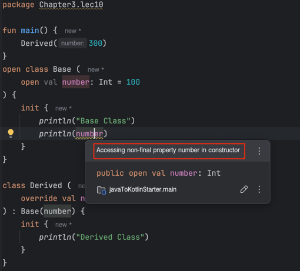
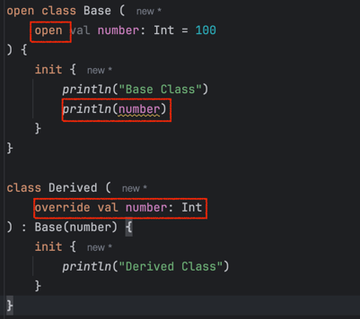

# Lec10. 코틀린에서 상속을 다루는 방법

## 📌 1. 추상 클래스

### ✨Animal이란 추상클래스를 구현한 Cat, Penguin
```java
package Chapter3.lec10;

public abstract class JavaAnimal {

	protected final String species;
	protected final int legCount;

	public JavaAnimal(String species, int legCount) {
		this.species = species;
		this.legCount = legCount;
	}

	abstract public void move();
	
	public String getSpecies() {
		return species;
	}

	public int getLegCount() {
		return legCount;
	}
}
```
```kotlin
package Chapter3.lec10

abstract class Animal (
    protected val name: String,
    protected open val legCount: Int
){

    abstract fun move()
}
```


```java
package Chapter3.lec10;

public class JavaCat extends JavaAnimal{
	
	public JavaCat(String species) {
		super(species, 4);
	}

	@Override
	public void move() {
		System.out.println("고양이가 사뿐 사뿐 걸어가~");
	}
}
```
```kotlin
package Chapter3.lec10

class Cat(
    species: String
) : Animal(species, 4){
    
    override fun move() {
        println("고양이가 사뿐 사뿐 걸어가~")
    }
}
```
```java
package Chapter3.lec10;

public final class JavaPenguin extends JavaAnimal {

	private final int wingCount;

	public JavaPenguin(String species) {
		super(species, 2);
		this.wingCount = 2;
	}

	@Override
	public void move() {
		System.out.println("펭귄이 움직입니다~ 꿱꿱");

	}

	@Override
	public int getLegCount() {
		return super.legCount + this.getLegCount();
	}
}

```
```kotlin
package Chapter3.lec10

class Penguin (
    species: String
) : Animal(species, 2) {

    private val wingCount: Int = 2

    override fun move() {
        println("펭귄이 움직인다~ 꿱꿱")
    }

    override val legCount: Int
        get() = super.legCount + this.wingCount
}
```
- 상위 클래스의 생성자를 바로 호출한다
- override를 필수적으로 붙여줘야 한다
- 추상 프로퍼티가 아니라면, 상속받을때 `open`을 꼭 붙여야 한다.
- 추상클래스에서 자동으로 만들어진 getter를 override와 Custom getter를 통해 재정의 할 수 있다.

> 자바와 코틀린의 추상클래스 공통점
> 1. 인스턴스화 할 수 없다!
> 2. 상위 클래스에 접근하는 키워드는 super이다.

## 📌 2. 인터페이스

### ✨Flyable과 Swimmable을 구현한 Penguin
```java
package Chapter3.lec10;

public interface JavaSwimmable {

	default void act() {
		System.out.println("어푸 어푸");
	}
}
```
```java
package Chapter3.lec10;

public interface JavaFlyable {

	default void act() {
		System.out.println("파닥 파닥");
	}
}

```
- Kotlin 인터페이스는 default 메소드 구현할때 default 키워드 없이 메소드 구현이 가능하다
- Kotlin에서도 추상 메소드를 만들 수 있다
```kotlin
package Chapter3.lec10

interface Swimmable {

    fun act() {
        println("어푸 어푸")
    }
}
```
```kotlin
package Chapter3.lec10

interface Flyable {
    // default 메소드  
    fun act() {
        println("파닥 파닥")
    }
    // 추상 메소드
    fun fly()
}
```
> Flayable과 Swimmable 인터페이스를 구현한 Penguin
```java
package Chapter3.lec10;

public final class JavaPenguin extends JavaAnimal implements JavaFlyable, JavaSwimmable {

	private final int wingCount;

	public JavaPenguin(String species) {
		super(species, 2);
		this.wingCount = 2;
	}

	@Override
	public void act() {
		JavaSwimmable.super.act();
		JavaFlyable.super.act();
	}
}
```
- 인터페이스 구현도 `콜론(:)`을 사용한다
- 중복되는 인터페이스를 특정할때 `super<타입>.함수`를 사용한다
```kotlin
package Chapter3.lec10

class Penguin (
    species: String
) : Animal(species, 2), Swimmable, Flyable {

    private val wingCount: Int = 2
    
    override fun act() {
        super<Swimmable>.act()
        super<Flyable>.act()
    }
}
```

> 자바와 코틀린의 인터페이스 공통점
> 1. 인스턴스화 할 수 없다!
>
### ✨주의 사항 : Kotlin에서는 backing field가 없는 프로퍼티를 Interface에 만들 수 있다.
```kotlin
package Chapter3.lec10

interface Swimmable {
    // 프로퍼티 : 이 프로퍼티는 Swimmable의 필드가 있는게 아니라,
    // 사실은 val이니까 getter에 대한 걸 아래에서 구현해주는 것을 기대한다
    val swimAbility: Int

    fun act() {
        println(swimAbility)// 구현체에서 swimAbility를 구현해주지 않으면 에러가 난다
        println("어푸 어푸")
    }
}
```
```kotlin
package Chapter3.lec10

class Penguin (
    species: String
) : Animal(species, 2), Swimmable, Flyable {

    private val wingCount: Int = 2
        ...
    override val swimAbility: Int
        get() = 3
}
```
- `프로퍼티`라는건 사실은 field라는 것도 있지만, getter라는 것도 있기 때문에 
- getter에 대한 default메소드나, getter에 대한 추상메소드를 인터페이스에 만드는 것이라 위의 예제 처럼 backing field없는 프로퍼티를 인터페이스에 만들 수 있다.

## 📌 3. 클래스를 상속할때 주의할 점
- 둘다 abstract클래스도, 인터페이스도 아닌 일반 클래스 2개 이다.
```kotlin
package Chapter3.lec10

fun main() {
    Derived(300) // 하위 클래스 인스턴스화!
}
open class Base (
    open val number: Int = 100
) {
    init {
        println("Base Class")
        println(number)
    }
}

class Derived (
    override val number: Int
) : Base(number) {
    init {
        println("Derived Class")
    }
}
```
```text
Base Class
0
Derived Class
```
> 0이 나오는 이유?
-   
- `Base`클래스의 `number`프로퍼티는 `open`이기 때문에 `Derived`클래스에서 `number`프로퍼티를 `override`할 수 있다.
- 해당 warning의 의미 : 상위 클래스 생성자가 먼저 실행된 단계라서 하위 클래스의 프로퍼티 즉, `number`프로퍼티가 초기화 되지 않았다는 것이다.
- 그 상태에서 먼저 하위클래스의 number에 접근하니까 100도 아니고 300도 아닌 Int의 초기값인 0이 출력된다.
- 다시 말하면 final이 아닌 필드에 접근하면 안된다.

  
- 상위 클래스에서 하위클래스가 override하고 있는 프로퍼티를 생성자 블럭이나 init블록에서 사용하면 이상한 값이 나올 수 있다.
> 주의 사항 : 상위 클래스를 설계할 때 생성자 또는 초기화 블록에 사용되는 프로퍼티에는 `open`을 피해야 한다!!!!

## 📌 4. 상속 관련 지시어 정리

- 1. final : override를 할 수 없게 한다. default로 보이지 않게 존재한다.
  - 클래스에서도 막고, 프로퍼티에서도 막는다. 
  - 그래서 일반 클래스를 다른 클래스가 상속받게 하려면 open을 붙어야 한다.
- 2. open : override를 열어준다. (상속을 해도 되고, 안해도 되고)
- 3. abstract : 반드시 override 해야 한다.
- 4. override : 상위 타입을 오버라이드 하고 있다.

## 📌 정리

- 상속 또는 구현을 할 때에 `:`을 사용해야 한다.
- 상위 클래스 상속을 구현할 때 생성자를 반드시 호출해야 한다.
- override를 필수로 붙어야 한다
- 추상 멤버가 아니면 기본적으로 오버라이드가 불가능하다.
  - `open`을 사용해주어야 한다.
- 상위 클래스의 생성자 또는 초기화 블록에서 open 프로퍼티를 사용하면 애기치 못한 버그가 생길 수 있다.