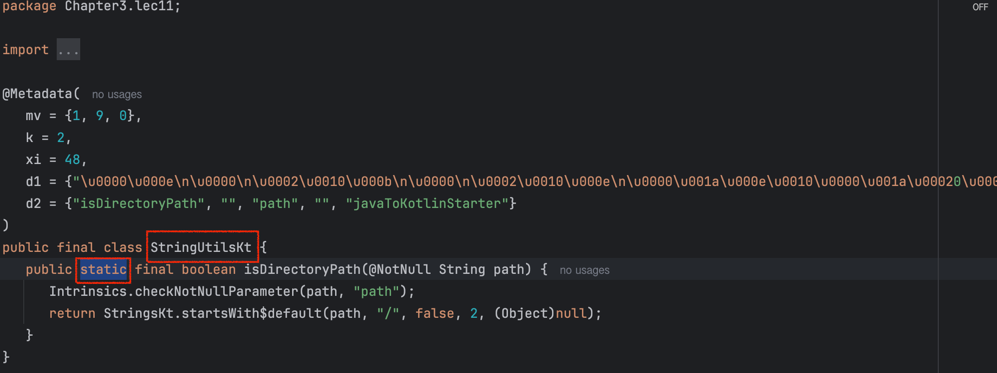

# Lec11. 코틀린에서 접근 제어를 다루는 방법


## 📌 1. 자바와 코틀린의 가시성 제어
| Modifier    | Java 설명                                      | Kotlin 설명                                  |
|-------------|------------------------------------------------|----------------------------------------------|
| `public`    | 모든 곳에서 접근 가능                          | 모든 곳에서 접근 가능                        |
| `protected` | 같은 패키지 또는 하위 클래스에서만 접근 가능    | `선언된 클래스` 또는 하위 클래스에서만 접근 가능 |
| `default`   | 같은 패키지에서만 접근 가능                    | Kotlin에는 `default`가 없으며 `internal`이 사용됨 |
| `private`   | 선언된 클래스 내에서만 접근 가능               | 선언된 클래스 내에서만 접근 가능             |
| `internal`  | - (Java에는 존재하지 않음)                    | `같은 모듈에서만 접근 가능`                    |

> 차이점
> - Kotlin에서는 패키지를 `namespace를 관리`하기 위한 용도로만 사용!
>   - 어떤 클래스가 어떤 패키지에 있구나라는 영역을 나누기 위한용도로만 사용된다
> - 가시성 제어에는 사용되지 않는다.
>   - 같은 패티지에 있으니까 너네끼리는 소통할 수 있어라는 가시성 제어는 안한다.
> - 즉, 코틀린에서는 패키지라는 개념을 접근 제어에 사용하지 않기 때문에, protected에서는 패키지가 빠지고,  
> - default대신 internal로 모듈을 접근제어하는 기능이 생겼다.

### ✨ 모듈이란 : 한 번에 컴파일되는 Kotlin 파일들의 집합
- IDEA Module
- Maven Project
- Gradle Source SEt
- Ant Task <kotlinc>의 호출로 컴파일 파일의 집합

### ✨ Java의 기본 접근 지시어는 `default`, Kotlin의 기본 접근 지시어는 `public`

## 📌 2. 코틀린 파일의 접근 제어

### ✨코틀린은 .kt 파일에 변수, 함수, 클래스 여러개를 바로 만들 수 있다.

```kotlin
package Chapter3.lec11

val a = 3

fun add(a: Int, b: Int): Int {
    return a + b
}
class Cat ()
```
| Modifier    | 설명                                 |
|-------------|--------------------------------------|
| `public`    | 기본값, 어디서든 접근할 수 있다.      |
| `protected` | 파일(최상단)에서는 **사용 불가능**    |
| `internal`  | 같은 모듈에서만 접근 가능            |
| `private`   | 같은 파일 내에서만 접근 가능         |


## 📌 3. 다양한 구성요소의 접근 제어 - 클래스 안의 멤버

### ✨ 클래스, 생성자, 프로퍼티

- 생성자도 가시성 범위는 동일하지만, 생성자에 접근 지시어를 붙이려면 `constructor` 를 써주셔야 합니다!
```kotlin
class Bus internal constructor (
    val price: Int
)

// 원래는 public constructor가 생략되어있다.
// 다른 접근 지시어를 쓰고 싶다면 constructor 키워드를 써야한다.
class Cat private constructor()

open class Dog protected constructor()
```

### ✨ 생성자에 접근 지시어를 붙이는 용례
- Java에서 `유틸성 코드`를 만들 때 abstract class + private constructor를 사용해서 인스턴스화를 막았다.
```java
public abstract class Stringutils {
    private StringUtils() {}
    
    public boolean isDirectoryPath(String path) {
        return path.endsWith("/");
    }
}
```
- kotlin에서도 비슷하게 가능하지만, `파일 최상단`에 바로 유틸 함수를 작성하면 편하다!!
```kotlin
package Chapter3.lec11

fun isDirectoryPath(path: String): Boolean {
    return path.startsWith("/")
}
```
- 해당 코드가 바이트 코드로 바뀌고, 디컴파일 해보면 아래처럼 나온다.
- StringUtils라는 파일이 StringUtilsKt 라는 클래스로 생기고, 이 클래스 안에 `static함수`로 isDirectoryPath가 있는걸 확인할 수 있다.
- 그래서 실제로 Java에서도 코틀린 파일에 있는 걸 접근할때 정적 메소드처럼 사용할 수 있다  

```java
package Chapter3.lec11;

public class Lec11Main {
	public static void main(String[] args) {
		StringUtilsKt.isDirectoryPath("/a.txt");
	}
}
```

### ✨프로퍼티의 가시성 범위도 동일하다. 하지만 프로퍼티의 가시성을 제어하는 방법으로 2가지가 있다
> 1. getter, setter 한 번에 접근 지시어를 정하거나
```kotlin
class Car (
    internal val name: String, // 여기 부분
    _price: Int
) {
    
}
```
> 2. Setter에만 추가로 가시성을 부여하거나
- getter는 public으로 두고, setter만 private로 두는 방법
```kotlin
class Car (
    val name: String,
    _price: Int
) {
    var price: Int = _price
        private set // 여기 부분
}
```
## 📌 4. Java와 Kotlin을 함께 사용할 경우 주의할 점

> 1. Internal은 바이트 코드상 `public`이 된다. 때문에 Java 코드에서는 Kotlin 모듈의 internal 코드를 가져올 수 있다.
- ex. 상위 모듈이 Java로 이루어졌고 하위 모듈이 Kotlin으로 이루어진 경우, 이 하위 모듈에 있는 internal이라고 감싸진 field나 함수 등을 상위 모듈의 Java에서는 바로 가져올 수 있다.
- 왜냐하면 Java와 Kotlin은 다르니까. 왜냐하면 코틀린에 있는 internal이 바이트코드로 바뀔때 Java와 합쳐지게 되는데 
- Java 입장에서는 결국 public을 바라보게 된다. 그래서 Java코드에서는 코틀린 모듈의 internal코드를 가져올 수 있다.

> 2. Kotlin의 `protected`는 java의 `protected`와 다르다. Java는 같은 패키지의 Kotlin protected 멤버에 접근할 수 있다.
- Java가 생각하는 protected랑 코틀린이 생각하는 protected가 달라서 
- Java 입장에서 같은 패키지에 있으니까 가져다 쓸께~ 할수 있다.

## 📌 정리

- Kotlin에서 패키지는 namespace 관리용이기 때문에 `protected`는 의미가 달라졌다.
- Kotlin애서는 `default`가 사라지고, 모듈간의 접근을 통제하는 `internal`이 새로 생겼다.
- 생성자에 접근 지시어를 붙일 때는 `constructor`를 명시적으로 써주어야 한다.
- 유틸성 함수를 만들 때는 파일 최상단을 이용하면 편리하다.
- 프로퍼티의 custom setter에 접근 지시어를 붙일 수 있다.
- Java에서 Kotlin코드를 사용할때 internal과 protected는 주의해야 한다.